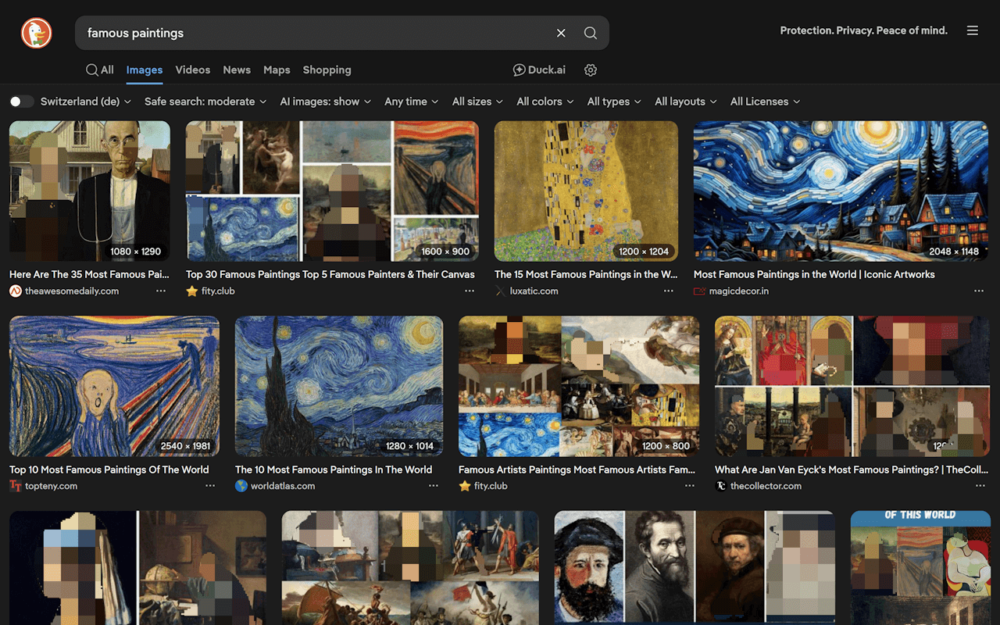

# Haram Block

[](LICENSE)
[](https://chromewebstore.google.com/detail/ffcbndjmpndbajnjcdbnbbmakmaflmok)
[](https://addons.mozilla.org/en-US/firefox/addon/haramblock/)

Gaze protection — a browser extension that blocks and filters inappropriate content from images and
videos, keeping you focused.

## Features

- **AI-Powered Detection** — Automatically detects and masks images and video frames
- **Per-Site Settings** — Control filtering for each website you visit
- **Multiple Masking Modes** — Bounding boxes, segmentation masks, or full-image masking
- **Adjustable Strictness** — Set your own threshold
- **Cross-Browser** — Works on Chrome and Firefox

## Screenshots



## Installation

### From Web Stores (Recommended)

- **Chrome**:
  [Chrome Web Store](https://chromewebstore.google.com/detail/ffcbndjmpndbajnjcdbnbbmakmaflmok)
- **Firefox**: [Firefox Add-ons](https://addons.mozilla.org/en-US/firefox/addon/haramblock/)

### Manual Install (Unpacked)

If you want to try HaramBlock before it’s in web stores, you can build it and load it as an unpacked
extension.

1. Build it (see “Build from Source” below).
2. Load it in your browser:
   - **Chrome / Edge / Brave**: open `chrome://extensions` → enable “Developer mode” → “Load
     unpacked” → select `.output/chrome-mv3`
   - **Firefox**: open `about:debugging#/runtime/this-firefox` → “Load Temporary Add-on…” → select
     `.output/firefox-mv3/manifest.json`

### Build from Source

Requires [Node.js](https://nodejs.org/) v18+ and [pnpm](https://pnpm.io/).

```bash
git clone https://github.com/govza/HaramBlock.git
cd HaramBlock
pnpm install
pnpm build          # Chrome output: .output/chrome-mv3
pnpm build:firefox  # Firefox output: .output/firefox-mv3
```

To generate store-ready ZIPs instead, use `pnpm zip` / `pnpm zip:firefox` (outputs to `.output/`).

## How to Use

1. Install the extension and pin it to your toolbar.
2. Browse normally — supported media is processed based on your current site policy.
3. Click the extension icon to change the policy for the current site:
   - **Whitelist** — Don’t filter anything on this site
   - **Blacklist** — Mask all supported media on this site
   - **Process** — Use AI to mask only what’s detected as inappropriate
4. Adjust **Strictness** and the masking style (bounding boxes / segmentation / full).

## How It Works

HaramBlock uses TensorFlow.js to run computer vision models directly in your browser. When you visit
a webpage, the extension scans images and video frames, applies AI detection, and blurs any content
that exceeds your configured strictness threshold.

## Documentation

- Developer docs index: `docs/INDEX.md`
- Most users only need this README; the `docs/` directory is primarily developer/architecture notes.

## Development

```bash
pnpm dev          # Development mode with hot reload
pnpm dev:firefox  # Firefox dev mode
pnpm test:unit    # Run tests
pnpm compile      # Type check
pnpm lint         # Check code style
pnpm fix          # Auto-fix formatting
```

For detailed architecture and internals, see `docs/INDEX.md`.

## Contributing

Contributions are welcome! Please fork the repository, create a feature branch, and submit a pull
request.

## License

GPL-3.0-only — See [LICENSE](LICENSE) for details.

## Contact

- **Author**: Rasul Abu Muhammad Amin
- **Email**: admin@haramblock.com
- **Website**: https://haramblock.com
