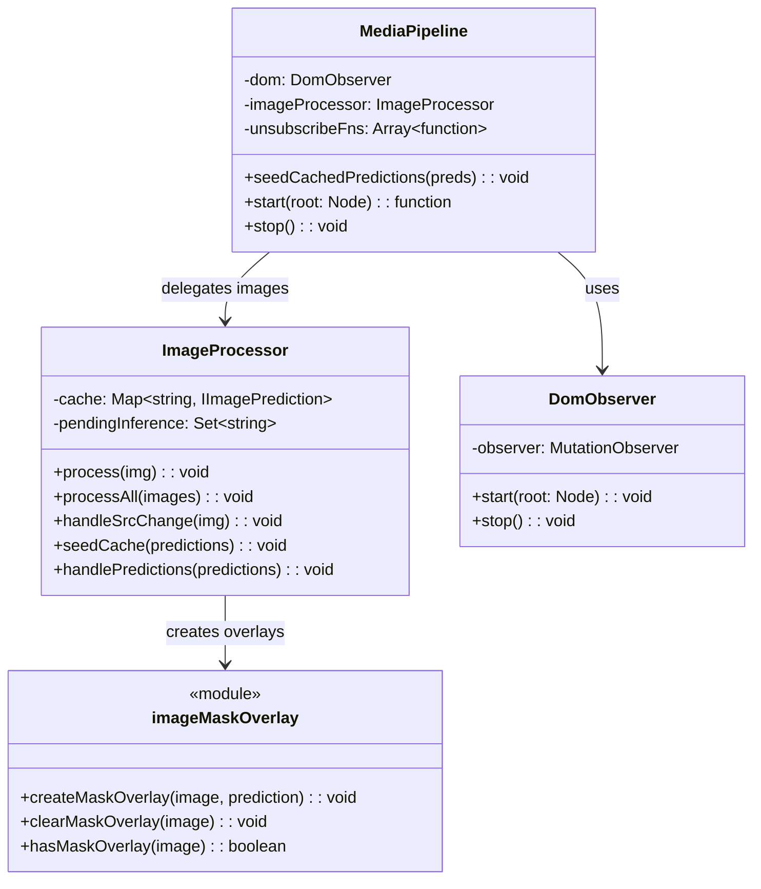

# Content Script Module

The HaramBlock content script lives in `entrypoints/content/`. It runs on web pages to observe the
DOM, queue inference, and apply masking styles to images and videos.

For architecture principles and design rationale, see
[CONTENT_PROCESSING.md](./CONTENT_PROCESSING.md).

## Architecture Overview

The content script follows a modular architecture with clear separation of concerns:

- **Entry Point** (`entrypoints/content/index.ts`) - Initialization and lifecycle management
- **Core** (`core/`) - DOM observation, image processing, media pipeline orchestration
- **Communication** (`communication/`) - Two-way messaging with the background script
- **Hooks** (`hooks/`) - Content-script initialization helpers (settings + cached predictions)
- **Presentation** (`presentation/`) - Visual styling, effects, and CSS injection
- **Handlers** (`handlers/`) - Video-specific handling
- **Video** (`video/`) - Frame capture + playback loop utilities

## Module Descriptions

### Entry Point

#### `index.ts`

The main content script entry point that orchestrates the entire media filtering system. It:

- Initializes global hiding styles to prevent content flash
- Uses the `useHostData` hook to get host settings and cached predictions
- Creates and manages content flow using `MediaPipeline` based on host policy
- Sets up inference result listeners for real-time AI predictions
- Handles cleanup on page unload

### Core (`core/`)

#### `core/DomObserver.ts`

Clean MutationObserver wrapper that directly processes DOM changes and emits structured callbacks
for media element lifecycle events.

**Key Features:**

- Scans existing DOM elements on startup to catch pre-existing media
- Processes added/removed nodes with nested element detection
- Monitors attribute changes for media elements
- Observes source attributes: `src`, `srcset`, `data-src`, `data-srcset`, `data-lazy-src`
- Supports reactive frameworks (Vue/React/Angular) that dynamically change `src`

#### `core/ImageProcessor.ts`

Handles image processing with DOM-derived state (no dataset attributes).

**Key Features:**

- State derived from blur class and overlay presence
- In-memory cache for predictions (Map<src, prediction>)
- Deduplicates inference requests via `pendingInference` Set
- Idempotent operations - safe to call multiple times
- Self-cleaning overlays via `trackedSrc` tracking

**Public API:**

```typescript
class ImageProcessor {
  process(img: HTMLImageElement): void;
  processAll(images: HTMLImageElement[]): void;
  handleSrcChange(img: HTMLImageElement): void;
  seedCache(predictions: IImagePrediction[]): void;
  handlePredictions(predictions: IImagePrediction[]): void;
}
```

#### `core/MediaPipeline.ts`

The main orchestrator that combines DOM observation with image/video processing.

**Key Features:**

- Uses `DomObserver` for DOM change detection
- Delegates image processing to `ImageProcessor`
- Handles video processing via `handleVideos`
- Subscribes to prediction broadcasts from background
- Manages cleanup and resource disposal

### Communication (`communication/`)

#### `listener.ts`

Handles all inbound messages from the background script.

**Message Types:**

- `ON_HOST_SETTINGS_UPDATED` - Notifies when host settings change
- `ON_INFERENCE_PREDICTIONS` - Delivers AI prediction results (images)
- `ON_FRAME_PREDICTIONS` - Delivers AI prediction results (video frames)

#### `sender.ts`

Manages all outbound communication to the background script.

**Key Functions:**

- `requestHostSettings()` - Gets current host settings
- `requestCachedPredictions()` - Retrieves cached AI predictions
- `requestImageInference()` - Sends image for AI processing
- `requestHostData()` - Parallel fetch of settings and predictions

### Hooks (`hooks/`)

#### `useHostData.ts`

Unified initializer for fetching host settings and cached predictions from the background.

**Return Interface:**

```typescript
{
  settings: IHostSettings;
  predictions: IImagePrediction[];
  isLoading: () => boolean;
  refresh: () => Promise<void>;
  cleanup: () => void;
}
```

### Presentation (`presentation/`)

#### `styleInjecting.ts`

Core CSS injection module that handles global style management.

- `injectGlobalHidingDomStyles()` - Prevents showing browser-cached images before DOM load
- `injectPredictionDomStyles()` - Injects CSS classes for blur effects and overlays

#### `initialStyling.ts`

Handles initial protective styling applied to media elements before AI analysis.

- `applyInitialImageStyling()` - Applies protective blur while waiting for AI analysis
- `removeInitialImageStyling()` - Removes protective styling after AI analysis

#### `predictionStyling.ts`

Handles AI prediction-based styling application.

- `applyPredictionsStyling()` - Applies AI-based styling using blur boxes or mask overlays

#### `boundingBox.ts`

Creates precise bounding box blur overlays for detected objects.

- `createBlurBoxOverlays()` - Creates positioned blur overlays using backdrop-filter
- Responsive positioning that adapts to image scaling and viewport changes
- Uses ResizeObserver and scroll/resize listeners for dynamic updates

#### `imageMaskOverlay.ts`

Segmentation-based visual overlays using canvas and mask data.

- Creates pixelated overlay effects using RLE-encoded segmentation masks
- Unified canvas approach combining multiple masks into single overlay
- Self-cleaning via `trackedSrc` - removes itself when image src changes

## Image Scaling and Letterboxing

This section documents how bounding boxes and segmentation masks are mapped from model space back to
the on-screen image when the `` element is resized or uses CSS `object-fit`.

### Coordinate Spaces

- **Original image space**: intrinsic pixels (`naturalWidth` x `naturalHeight`)
- **Model input space**: letterboxed model input (e.g., 640x640) and output mask grid (e.g.,
  160x160)
- **Page element box**: the rendered CSS box (`getBoundingClientRect`)
- **Content rect**: visible image pixels inside the box after `object-fit` is applied

### Letterboxing Transform

During preprocessing, the original image is scaled to fit the model input with letterboxing. The
`calculateScaleFactors()` function returns:

- `offsetX, offsetY`: padding (in grid units) around the scaled image
- `scaleX, scaleY`: convert from grid coords (after removing offset) into original pixel coords

### Content-Side Mapping

Utilities in `imageLayout.ts`:

- `computeRenderedContentRect(image)` - Computes the visible image area inside the element box,
  accounting for `object-fit: fill | contain | cover | none | scale-down`
- `maskGridSrcRect(maskTransform, originalW, originalH)` - Returns the sub-rectangle within the mask
  grid that corresponds to valid image pixels (excludes letterbox padding)

### Bounding Box Mapping

1. Get `contentRect = computeRenderedContentRect(...)`
2. Compute scale: `scaleX = contentRect.width / originalWidth`
3. Position overlay: `left = contentRect.offsetX + x * scaleX`

### Segmentation Mask Mapping

1. Create canvas overlay sized to element box
2. Draw pixelated image within `contentRect`
3. Decode RLE mask and draw to mask grid canvas
4. Crop valid region using `maskGridSrcRect()` and scale to `contentRect`
5. Composite with `destination-in` to apply mosaic only to masked pixels

## Class Relationships



## Performance Considerations

- **DOM-derived state**: No dataset attributes, state read from blur class and overlay presence
- **Deduplication**: `pendingInference` Set prevents duplicate requests per src
- **Cached predictions**: Previously analyzed images styled immediately from cache
- **Parallel data fetching**: Settings and predictions fetched simultaneously on init
- **RequestAnimationFrame**: Overlay creation batched for smooth rendering
- **Self-cleaning overlays**: No manual cleanup needed when src changes

## Error Handling

- Communication failures logged and gracefully handled
- Image loading errors don't prevent processing of other images
- AI processing failures don't affect cached predictions
- Predictions for changed src silently ignored (matched by src, not element)

## Policies

- **Whitelist**: Skip all processing, allow content through
- **Blacklist**: Apply immediate heavy blur/opacity
- **Default (process)**: Apply protective blur while waiting for AI analysis, then apply overlays
