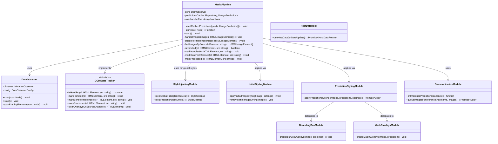

# Content Script Module

The HaramBlock content script lives in `entrypoints/content/`. It runs on web pages to observe the
DOM, queue inference, and apply masking styles to images and videos.

## Architecture Overview

The content script follows a modular architecture with clear separation of concerns:

- **Entry Point** (`entrypoints/content/index.ts`) - Initialization and lifecycle management
- **Core** (`core/`) - DOM observation, state registry, AI queueing, background bridge, prediction
  store, and orchestration
- **Communication** (`communication/`) - Two-way messaging with the background script
- **Hooks** (`hooks/`) - Content-script initialization helpers (settings + cached predictions)
- **Presentation** (`presentation/`) - Visual styling, effects, and CSS injection
- **Handlers** (`handlers/`) - Media-specific entrypoints (images/videos)
- **Video** (`video/`) - Frame capture + playback loop utilities

## Module Descriptions

### Entry Point

#### `index.ts`

The main content script entry point that orchestrates the entire media filtering system. It:

- Initializes global hiding styles to prevent content flash
- Uses the `useHostData` hook to get host settings and cached predictions
- Creates and manages content flow using `MediaPipeline` based on host policy
- Sets up inference result listeners for real-time AI predictions
- Handles cleanup on page unload

### DOM Processing (`core/`)

#### Direct DOM State Tracking

State management moved from centralized MediaStore to direct DOM element dataset attributes. This
provides simpler state tracking and eliminates the complexity of element-to-group mappings.

**Key Features:**

- **Dataset-based state tracking**: Uses `data-hb-*` attributes on DOM elements directly
- **Per-element source tracking**: `data-hb-src` tracks current processed source URL
- **Processing flags**: `data-hb-handled`, `data-hb-sent`, `data-hb-processed` for state management
- **Dynamic src handling**: Automatically clears flags when element `src` attribute changes
- **Memory efficient**: No WeakMap or centralized storage needed
- **Prevents duplicate processing**: State flags prevent redundant inference requests per element
- **Source change detection**: Compares `data-hb-src` with current element source to detect changes

#### `core/DomObserver.ts`

Clean MutationObserver wrapper that directly processes DOM changes and emits structured callbacks
for media element lifecycle events.

**Key Features:**

- Scans existing DOM elements on startup to catch pre-existing media
- Processes added/removed nodes with nested element detection
- **Monitors attribute changes** for media elements with `attributeOldValue: true` for debugging
- Observes different media source attributes: `src`, `srcset`, `data-src`, `data-srcset`,
  `data-lazy-src`
- **Reactive framework support**: Detects when Vue/React/Angular dynamically change `src` attributes
- **Real-time debugging**: Logs attribute changes with old/new values for troubleshooting

#### `core/MediaPipeline.ts`

The main orchestrator that combines DOM observation with AI-powered content analysis and styling.

**Key Features:**

- Uses `DomObserver` for DOM change detection
- Manages media elements through direct DOM dataset attributes for state tracking
- Applies immediate protective styling based on policy (blacklist/whitelist)
- Handles cached predictions instantly, queues uncached images for AI processing
- Tracks AI processing per source URL to prevent duplicate inference requests
- Applies intelligent styling when AI predictions arrive
- Manages cleanup and resource disposal
- **Attribute change handling**: Responds to `onAttributesChanged` events by re-processing images
  with new sources
- **Anti-flickering logic**: Uses `requestAnimationFrame` to ensure proper timing between overlay
  creation and initial style removal
- **Comprehensive debugging**: Extensive logging with `flickering` tag to track styling operations
  and timing

### Communication (`communication/`)

#### `listener.ts`

Handles all inbound messages from the background script using comctx.

**Message Types:**

- `ON_HOST_SETTINGS_UPDATED` - Notifies when host settings change
- `ON_INFERENCE_PREDICTIONS` - Delivers AI prediction results

**Key Features:**

- Provides filtered listeners for specific hostnames
- Offers utility functions for setting up multiple listeners
- Returns cleanup functions for proper resource management

#### `sender.ts`

Manages all outbound communication to the background script.

**Key Functions:**

- `requestHostSettings()` - Gets current host settings
- `requestCachedPredictions()` - Retrieves cached AI predictions
- `queueImagesForInference()` - Sends images for AI processing
- `requestHostData()` - Parallel fetch of settings and predictions

### Hooks (`hooks/`)

#### `useHostData.ts`

Unified initializer for fetching host settings and cached predictions from the background.

**Key Features:**

- Fetches both settings and predictions in parallel for efficiency
- Provides loading state and manual refresh capabilities
- Handles hostname normalization using `getEffectiveHostname()`
- Subscribes to host-settings updates and reloads the page to ensure a clean state

**Return Interface:**

```typescript
{
  settings: IHostSettings;
  predictions: IImagePrediction[];
  isLoading: () => boolean;
  refresh: () => Promise<void>;
  cleanup: () => void;
}
```

### Presentation (`presentation/`)

#### `styleInjecting.ts`

Core CSS injection module that handles global style management.

**Core Functions:**

- `injectGlobalHidingDomStyles()` - Prevents showing browser-cached images before DOM load, returns
  cleanup function
- `injectPredictionDomStyles()` - Injects CSS classes for blur effects and overlays

#### `initialStyling.ts`

Handles initial protective styling applied to media elements before AI analysis.

**Core Functions:**

- `applyInitialImageStyling()` - Applies protective blur while waiting for AI analysis
- `removeInitialImageStyling()` - Removes protective styling after AI analysis

#### `predictionStyling.ts`

Handles AI prediction-based styling application.

**Core Functions:**

- `applyPredictionsStyling()` - **Async function**: Applies AI-based styling using blur boxes or
  mask overlays based on host settings, returns Promise that resolves when overlays are positioned

#### `boundingBox.ts`

Creates precise bounding box blur overlays for detected objects.

**Key Features:**

- `createBlurBoxOverlays()` - Creates positioned blur overlays using backdrop-filter
- Responsive positioning that adapts to image scaling and viewport changes
- Uses ResizeObserver and scroll/resize listeners for dynamic updates
- Clips blur boxes to visible image areas for performance
- Automatically manages parent element positioning (sets relative if static)

#### `maskOverlays.ts`

Advanced segmentation-based visual overlays using canvas and mask data.

**Key Features:**

- `createMaskOverlays()` - Creates pixelated overlay effects using segmentation masks
- Unified canvas approach combining multiple masks into single overlay
- Pixelated mosaic effect (20px blocks) applied only to masked regions
- Adaptive sampling and bounds checking for performance
- Alpha masking technique preserving original image colors with pixelation

## Image Scaling and Letterboxing

This section documents how bounding boxes and segmentation masks are mapped from model space back to
the on‑screen image when the `` element is resized, letterboxed, or uses CSS `object-fit`.

### Terms and Spaces

- Original image space: intrinsic pixels (`naturalWidth` × `naturalHeight`).
- Model input space: letterboxed model input (e.g., 640×640) and model output mask grid (e.g.,
  160×160).
- Page element box: the rendered CSS box of the `` (`getBoundingClientRect`).
- Content rect: the actually visible image pixels inside the `` box after `object-fit` and
  `object-position` are applied.

### Background: Letterboxing Transform

During preprocessing, the original image is scaled to fit the model input with letterboxing. We
compute and cache a transform that can map from model output grid coordinates back to original image
pixels:

- `calculateScaleFactors(originalW, originalH, modelW, modelH)` returns:
  - `offsetX, offsetY`: padding (in grid units) around the scaled image inside the model/grid.
  - `scaleX = originalW / scaledW`, `scaleY = originalH / scaledH`: convert from grid coords (after
    removing offset) into original image pixel coords.

For segmentation, the same transform is calculated against the model output grid (e.g., 160×160), so
offsets and scales are expressed in “grid cells”.

### Content-Side Mapping Flow

Shared utilities in `imageLayout.ts` encapsulate the mapping:

- `computeRenderedContentRect(image, imageRect?)`:
  - Computes the inner content rectangle (offsets + size) of the visible image inside the ``
    box.
  - Supports `object-fit: fill | contain | cover | none | scale-down` and `object-position`.

- `maskGridSrcRect(maskTransform, originalW, originalH)`:
  - Returns the sub-rectangle within the mask grid that corresponds to valid image pixels (excludes
    letterbox padding).
  - `srcX = offsetX`, `srcY = offsetY`, `srcW = originalW / scaleX`, `srcH = originalH / scaleY`.

- `displayScaleFromOriginal(originalW, originalH, contentW, contentH)`:
  - Linear scale factors from original image pixel space to the on‑screen content rect.

### Bounding Boxes (`presentation/boundingBox.ts`)

1. Read `imageRect = getBoundingClientRect()` and `contentRect = computeRenderedContentRect(...)`.
2. Compute `scaleX = contentRect.width / originalWidth` and
   `scaleY = contentRect.height / originalHeight`.
3. For each prediction bounding box (already in original pixel coords), place and size the overlay
   as:
   - `left = (imageRect.left - parentRect.left) + contentRect.offsetX + x * scaleX`
   - `top = (imageRect.top - parentRect.top) + contentRect.offsetY + y * scaleY`
   - `width = width * scaleX`, `height = height * scaleY`
4. Clip to the visible intersection with the image’s parent for robustness.

### Segmentation Masks (`presentation/maskOverlays.ts`)

1. Create a single canvas overlay sized to the `` element box.
2. Compute `contentRect = computeRenderedContentRect(...)` and draw the pixelated image only within
   that rect (leaving the rest transparent).
3. Build a temporary `maskGrid` canvas the size of the model output grid (e.g., 160×160):
   - For each detection’s binary mask, OR cells above threshold, but only if the corresponding
     original pixel lies inside the detection’s bounding box. This uses the inverse of the letterbox
     transform:
     - `imgX = (gridX - offsetX) * scaleX`
     - `imgY = (gridY - offsetY) * scaleY`
     - Keep if `imgX,imgY` within both the original image bounds and the detection’s bbox.
4. Crop the valid mask sub-rect using `maskGridSrcRect(maskTransform, originalW, originalH)` and
   draw it into the overlay at `contentRect` with `imageSmoothingEnabled = false` for crisp pixels.
5. Composite the scaled mask with the pixelated image using `destination-in` so the mosaic applies
   only to masked pixels.

### Why This Works

- Bounding boxes are defined in original image pixels; we scale them purely by the ratio between the
  content rect and the original size.
- Segmentation masks are defined in the model’s output grid; we crop out the letterbox padding, then
  scale the remaining grid to exactly the visible content rect.
- Using the same content rect for both ensures masks and boxes stay aligned even when
  `width < naturalWidth` or when `object-fit` introduces padding/cropping.

**Styling Strategy:** The module implements a two-stage filtering approach:

1. **Immediate Protection:** Basic blur styling applied instantly when images are detected
2. **AI-Enhanced Filtering:** Sophisticated overlays applied after AI analysis using either bounding
   boxes or segmentation masks

## Class Relationships



## Processing Flow

1. **Initialization:**
   - Content script injects global hiding styles to prevent display of cached images \*Removed after
     DOMContentLoaded event
   - `useHostData` fetches host settings and cached predictions in parallel
   - `MediaPipeline` is created with settings and seeded with cached predictions
   - `applyInitialImageStyling` is applied to existing images (protective blurring/masking)
   - `DomObserver` starts monitoring the DOM and scans existing elements

2. **Media Detection:**
   - `DomObserver` detects added, removed, and attribute-changed media elements
   - Direct callback interface eliminates event bus complexity
   - Processes both direct elements and nested elements within added nodes
   - **Attribute monitoring**: Detects when reactive frameworks change `src` attributes dynamically

3. **Immediate Processing:**
   - Whitelist policy: Skip processing entirely
   - Default policy: Check for cached predictions first, then apply initial protective styling using
     `applyInitialImageStyling()`
   - Elements are marked as handled using DOM dataset attributes to prevent duplicate processing

4. **Dynamic Source Handling:**
   - When `onAttributesChanged` detects `src` changes (e.g., Vue reactive updates):
     - Previous overlays are cleared using `clearMaskOverlay()` and `clearBlurBoxOverlay()`
     - Dataset flags are reset: `data-hb-handled`, `data-hb-sent`, `data-hb-processed`
     - New `src` is stored in `data-hb-src` and queued for AI inference if not cached
     - Prevents orphaned predictions from affecting wrong elements

5. **AI Processing Queue:**
   - Images without cached predictions are queued for AI inference via `queueForInference()`
   - Uses `isSentForInference()` check to prevent duplicate requests per source
   - Only queues images that meet minimum size requirements and are fully loaded
   - Attaches one-time load listeners for images not yet ready
   - Sources are marked as sent for inference using `markSentForInference()`

6. **State Management:**
   - **Direct DOM tracking**: Elements store state directly in dataset attributes
   - **Per-element state flags**: `data-hb-handled`, `data-hb-sent`, `data-hb-processed` prevent
     duplicate work
   - **Source tracking**: `data-hb-src` stores currently processed source URL
   - **Automatic cleanup**: No centralized storage means no manual cleanup needed
   - **Memory efficient**: State lives on DOM elements, garbage collected automatically

7. **Result Application (Anti-Flickering):**
   - AI predictions arrive via communication listener in `onPredictions()`
   - Local predictions cache is updated with new results
   - **Async styling application**: `applyPredictionsStyling()` uses `requestAnimationFrame` for
     proper timing
   - **Only applies to matching elements**: `findImagesBySourceInDom()` returns elements that still
     match the prediction source
   - Initial protective styling is removed via `removeInitialImageStyling()` ONLY after overlays are
     positioned
   - Elements are marked as processed using dataset attributes to prevent re-styling

8. **Cleanup:**
   - On page unload, `DomObserver` disconnects via `stop()`
   - Prediction listeners are unsubscribed via stored cleanup functions
   - DOM dataset attributes are automatically cleaned up with elements

## Performance Considerations

- **Direct Callback Processing:** Eliminated event bus overhead with direct callback interface
- **Direct DOM State Tracking:** Elements store processing state directly avoiding centralized state
  management overhead
- **Processing State Tracking:** Uses state flags (`handled`, `sentForInference`, `processed`) to
  prevent duplicate work per source
- **State-Based Deduplication:** Uses `isSentForInference()` checks to prevent duplicate inference
  requests
- **One-Time Load Listeners:** Avoids repeated listener attachments with proper cleanup
- **Cached Predictions:** Previously analyzed images skip AI processing and are styled immediately
- **Parallel Data Fetching:** Settings and predictions are fetched simultaneously during
  initialization
- **Efficient DOM Queries:** `findImagesBySourceInDom()` queries DOM only when predictions arrive
- **No Memory Overhead:** Direct dataset storage eliminates need for centralized maps or WeakMaps
- **RequestAnimationFrame Batching:** Overlay creation is batched using `requestAnimationFrame` for
  smooth rendering
- **Parallel Prediction Processing:** Multiple predictions are processed concurrently using
  `Promise.all()`
- **Automatic Memory Management:** Dataset attributes are garbage collected with DOM elements

## Error Handling

- Communication failures are logged and gracefully handled
- Image loading errors don't prevent processing of other images
- AI processing failures don't affect cached predictions
- Metadata extraction via HEAD is best-effort and ignored on failure
- Cleanup functions prevent memory leaks on page navigation
- **URL mismatch detection**: Logs errors when predictions don't match current DOM element sources
- **Graceful orphaned predictions**: Predictions for elements that no longer exist are safely
  ignored
- **Attribute change failures**: Robust handling of malformed or invalid `src` attribute changes

## Notes on Policies and Thresholds

- **Whitelist policy:** Completely skips all processing, allowing all content through
- **Blacklist policy:** Applies immediate heavy blur/opacity for both images and videos
- **Default policy:** Applies protective styling while waiting for AI analysis
- Minimum image size for AI processing is configurable via host settings
- Images not meeting size requirements get one-time load listeners for re-evaluation after loading
- Observed attributes include common lazy-load patterns: `src`, `srcset`, `data-src`, `data-srcset`,
  `data-lazy-src`
- Processing state is tracked per source URL to prevent duplicate work across multiple DOM elements
- **Reactive framework compatibility**: Handles Vue, React, Angular dynamic `src` changes seamlessly
- **Anti-flickering timing**: `requestAnimationFrame` ensures overlays render before protective
  styles are removed
- **Debug logging**: Comprehensive logging with `flickering` tag and `extractUrlId` for readable
  debugging
