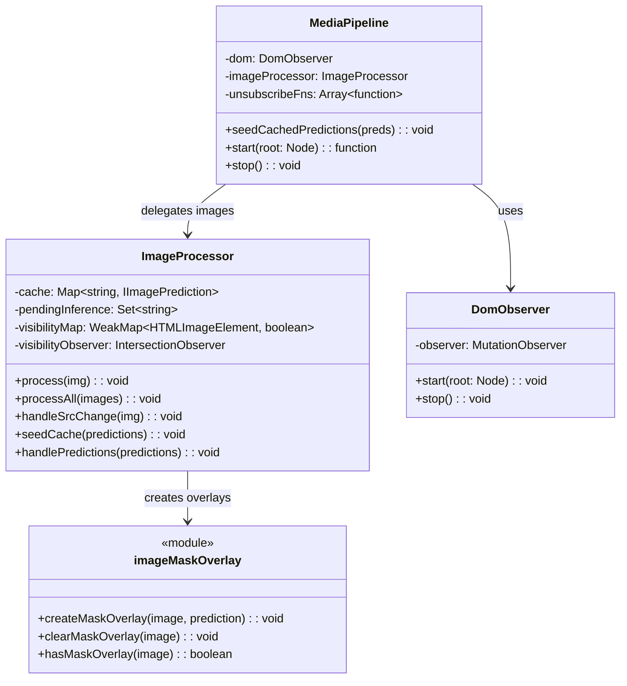

# Media Processing

This document describes the content script's media processing system - both the architectural design
and module-level implementation details.

The content script lives in `entrypoints/content/`. It runs on web pages to observe the DOM, queue
inference, and apply masking styles to images and videos.

## Design Principles

1. **Derive state from DOM** - Don't track state separately; read it from CSS classes and overlays
2. **Idempotent operations** - Applying blur twice = no-op, safe to retry
3. **Fire and forget** - Queue async work, never block the observer
4. **Last write wins** - No version tracking; latest prediction for a src just overwrites
5. **Self-cleaning overlays** - Overlays detect when their image changes and clean themselves

## Architecture Overview

The content script follows a modular architecture with clear separation of concerns:

- **Entry Point** (`entrypoints/content/index.ts`) - Initialization and lifecycle management
- **Core** (`core/`) - DOM observation, image processing, media pipeline orchestration
- **Communication** (`communication/`) - Two-way messaging with the background script
- **Hooks** (`hooks/`) - Content-script initialization helpers (settings + cached predictions)
- **Presentation** (`presentation/`) - Visual styling, effects, and CSS injection
- **Handlers** (`handlers/`) - Video-specific handling
- **Video** (`video/`) - Frame capture + playback loop utilities

## Module Descriptions

### Entry Point

#### `index.ts`

The main content script entry point that orchestrates the entire media filtering system. It:

- Initializes global hiding styles to prevent content flash
- Uses the `useHostData` hook to get host settings and cached predictions
- Creates and manages content flow using `MediaPipeline` based on host policy
- Sets up inference result listeners for real-time AI predictions
- Handles cleanup on page unload

### Core (`core/`)

#### `core/DomObserver.ts`

Clean MutationObserver wrapper that directly processes DOM changes and emits structured callbacks
for media element lifecycle events.

**Key Features:**

- Scans existing DOM elements on startup to catch pre-existing media
- Processes added/removed nodes with nested element detection
- Monitors attribute changes for media elements
- Observes source attributes: `src`, `srcset`, `data-src`, `data-srcset`, `data-lazy-src`
- Supports reactive frameworks (Vue/React/Angular) that dynamically change `src`

#### `core/ImageProcessor.ts`

Handles image processing with DOM-derived state (no dataset attributes).

**Key Features:**

- State derived from blur class and overlay presence
- In-memory cache for predictions (Map<src, prediction>)
- Deduplicates inference requests via `pendingInference` Set
- Idempotent operations - safe to call multiple times
- Self-cleaning overlays via `trackedSrc` tracking
- Viewport-based priority via `IntersectionObserver` (visible images processed first)

**Public API:**

```typescript
class ImageProcessor {
  process(img: HTMLImageElement): void;
  processAll(images: HTMLImageElement[]): void;
  handleSrcChange(img: HTMLImageElement): void;
  seedCache(predictions: IImagePrediction[]): void;
  handlePredictions(predictions: IImagePrediction[]): void;
}
```

#### `core/MediaPipeline.ts`

The main orchestrator that combines DOM observation with image/video processing.

**Key Features:**

- Uses `DomObserver` for DOM change detection
- Delegates image processing to `ImageProcessor`
- Handles video processing via `handleVideos`
- Subscribes to prediction broadcasts from background
- Manages cleanup and resource disposal

### Communication (`communication/`)

#### `listener.ts`

Handles all inbound messages from the background script.

**Message Types:**

- `ON_HOST_SETTINGS_UPDATED` - Notifies when host settings change
- `ON_INFERENCE_PREDICTIONS` - Delivers AI prediction results (images)
- `ON_FRAME_PREDICTIONS` - Delivers AI prediction results (video frames)

#### `sender.ts`

Manages all outbound communication to the background script.

**Key Functions:**

- `requestHostSettings()` - Gets current host settings
- `requestCachedPredictions()` - Retrieves cached AI predictions
- `requestImageInference()` - Sends image for AI processing
- `requestHostData()` - Parallel fetch of settings and predictions

### Hooks (`hooks/`)

#### `useHostData.ts`

Unified initializer for fetching host settings and cached predictions from the background.

**Return Interface:**

```typescript
{
  settings: IHostSettings;
  predictions: IImagePrediction[];
  isLoading: () => boolean;
  refresh: () => Promise<void>;
  cleanup: () => void;
}
```

### Presentation (`presentation/`)

#### `styleInjecting.ts`

Core CSS injection module that handles global style management.

- `injectGlobalHidingDomStyles()` - Prevents showing browser-cached images before DOM load
- `injectPredictionDomStyles()` - Injects CSS classes for blur effects and overlays

#### `initialStyling.ts`

Handles initial protective styling applied to media elements before AI analysis.

- `applyInitialImageStyling()` - Applies protective blur while waiting for AI analysis
- `resetImageStyling()` - Clears all styling for reprocessing
- `finalizeImageProcessing()` - Removes styling and sets final processed status
  (safe/unsafe/skipped)

##### Processed Status Attributes

Media elements can expose their final processing outcome via boolean data attributes. These are set
by `finalizeImageProcessing(image, status)` and cleared by `resetImageStyling(image)`.

- `data-haramblock-processed-safe` — AI found no unsafe content
- `data-haramblock-processed-unsafe` — AI detected unsafe content
- `data-haramblock-processed-skipped` — Processing was skipped (unsupported format, too small, or
  error)

Notes:

- Exactly one of these attributes is present after finalization; all are removed on reset or when
  the image `src` changes.
- Use them for CSS hooks or analytics. Example CSS:

```css
img[data-haramblock-processed-unsafe] {
  outline: 2px solid rgba(255, 0, 0, 0.4);
}
img[data-haramblock-processed-safe] {
  outline: 1px dashed rgba(0, 128, 0, 0.3);
}
```

#### `predictionStyling.ts`

Handles AI prediction-based styling application.

- `applyPredictionsStyling()` - Applies AI-based styling using blur boxes or mask overlays

#### `boundingBox.ts`

Creates precise bounding box blur overlays for detected objects.

- `createBlurBoxOverlays()` - Creates positioned blur overlays using backdrop-filter
- Responsive positioning that adapts to image scaling and viewport changes
- Uses ResizeObserver and scroll/resize listeners for dynamic updates

#### `imageMaskOverlay.ts`

Segmentation-based visual overlays using canvas and mask data.

- Creates pixelated overlay effects using RLE-encoded segmentation masks
- Unified canvas approach combining multiple masks into single overlay
- Self-cleaning via `trackedSrc` - removes itself when image src changes

## Initialization: Preventing Flash of Unfiltered Content

Browser-cached images can render before the content script has a chance to process them. To prevent
this "flash of unfiltered content":

```
document_start (earliest possible)
       │
       ▼
Inject global hiding: img { opacity: 0 !important; }
       │
       ▼
Fetch host settings + cached predictions (async)
       │
       ▼
DOMContentLoaded
       │
       ▼
Start MediaPipeline (processes existing images, applies blur/overlays)
       │
       ▼
Remove global hiding style
       │
       └── Images now visible with appropriate blur/overlay applied
```

**Key points:**

- `runAt: 'document_start'` ensures we inject hiding style before any images render
- Global `opacity: 0` hides ALL images until we're ready
- Removal happens AFTER pipeline starts, so images are already protected
- If whitelist policy or error, hiding is removed immediately (no processing needed)

This is **separate from per-image blur** - the global hide is a startup-only safeguard, while blur
class is the ongoing protection during inference.

## State Model

State is **derived from DOM**, not tracked separately:

| DOM Condition              | Derived State   | Meaning               |
| -------------------------- | --------------- | --------------------- |
| No blur class, no overlay  | **Unprocessed** | Needs processing      |
| Has blur class, no overlay | **Pending**     | Waiting for inference |
| Has overlay (± blur class) | **Complete**    | Prediction applied    |

```typescript
// State derived from DOM - no tracking needed
function getState(img: HTMLImageElement): 'unprocessed' | 'pending' | 'complete' {
  if (hasOverlay(img)) return 'complete';
  if (hasBlurClass(img)) return 'pending';
  return 'unprocessed';
}
```

## Processing Flow

### MutationObserver Callback (Must be fast!)

```
onMediaAdded/onAttributesChanged(img)
       │
       ├── Has overlay for CURRENT src? → Done (already complete)
       │
       ├── In cache? → Apply prediction immediately
       │
       └── Neither? → Apply blur, queue inference

Total blocking time: ~1ms (just class manipulation)
```

### Inference Queue (Async, non-blocking)

```
queueInference(img, src)
       │
       ▼
[Async] Wait for load if needed
       │
       ▼
Check visibility (IntersectionObserver)
       │
       ▼
[Async] Send to background with priority
       │
       └── No callbacks, no state updates
           Background will broadcast prediction when ready
```

### Viewport-Based Priority

Images visible in the viewport are processed before offscreen images. This improves perceived
performance by prioritizing above-the-fold content.

**How it works:**

1. `ImageProcessor` maintains an `IntersectionObserver` that tracks image visibility
2. When an image is queued for inference, its visibility is checked
3. Visible images get `priority=10`, offscreen images get `priority=0`
4. The background queue (p-queue) processes higher priority tasks first

```typescript
// In ImageProcessor
this.visibilityObserver = new IntersectionObserver(
  entries => {
    for (const entry of entries) {
      this.visibilityMap.set(entry.target, entry.isIntersecting);
    }
  },
  { rootMargin: '200px' } // Pre-fetch slightly outside viewport
);

// When sending for inference
const isVisible = this.visibilityMap.get(img) ?? false;
const priority = isVisible ? PRIORITY_VISIBLE : PRIORITY_OFFSCREEN;
await requestImageInference(hostname, img, priority);
```

**Priority values:**

| Media Type       | Priority | Description                        |
| ---------------- | -------- | ---------------------------------- |
| Visible images   | 10       | In viewport (+ 200px margin)       |
| Offscreen images | 0        | Below fold or hidden               |
| Video frames     | 10       | Active playback (user is watching) |
| Video thumbnails | 10       | Usually visible when processed     |

**Note:** p-queue uses higher number = higher priority (runs first).

### Prediction Broadcast (Background → Content)

```
onPrediction({ src, predictions })
       │
       ▼
Find all img elements with this src
       │
       ▼
For each: apply overlay, remove blur class
       │
       └── If img.src changed, overlay auto-cleans via ResizeObserver
```

## Handling Source Changes

Instead of complex version tracking, use **idempotent re-detection**:

```
src changes (MutationObserver fires)
       │
       ▼
handleSrcChange(img)
       │
       ├── Clear existing overlays
       │
       └── Process as new image:
              ├── Check cache for new src
              ├── Apply blur if not cached
              └── Queue inference if needed
```

### Self-Cleaning Overlays

Overlays track the `src` they were created for and self-clean when it changes:

```typescript
// In ResizeObserver callback
const currentSrc = image.currentSrc || image.src;
if (state.trackedSrc && currentSrc !== state.trackedSrc) {
  this.clearMaskOverlay(image); // Self-cleanup
  return;
}
```

## Race Conditions - Why They Don't Matter

### Old Pattern (Complex)

```
t=0: Inference starts for src=A
t=1: src changes to B
t=2: Inference for A completes
t=3: Check version... reject... complex logic...
```

### New Pattern (Simple)

```
t=0: Inference starts for src=A
t=1: src changes to B, blur applied, new inference queued
t=2: Inference for A completes, tries to find img[src=A]
t=3: No match found (src is now B), prediction cached but not applied
t=4: Inference for B completes, applies to img[src=B] ✓
```

**Key insight**: Predictions are matched by `src`, not by element reference. If the src changed, the
old prediction simply won't find any matching elements.

## Handling Rapid Source Changes (Google Images)

Some sites like Google Images rapidly change image `src` attributes for quality upgrades, lazy
loading, or A/B testing. This creates a challenge where by the time an image loads, its src has
already changed multiple times.

### The Problem

```
t=0: Image added with src=A (low quality placeholder)
t=1: queueInference(src=A), attach load listener
t=2: Google changes src to B (medium quality)
t=3: handleSrcChange fires, queueInference(src=B)
t=4: Google changes src to C (high quality)
t=5: handleSrcChange fires, queueInference(src=C)
t=6: Load listener for A fires, but currentSrc is now C → abort
t=7: Load listener for B fires, but currentSrc is now C → abort
t=8: Image stuck with blur forever (no inference ever sent for C)
```

### The Solution: Debounced Source Change Handling

Instead of immediately processing on every src change, we **debounce** the processing:

```typescript
const SRC_STABILIZATION_DELAY = 150; // ms

handleSrcChange(img: HTMLImageElement): void {
  // Clear overlays and apply blur immediately (visual feedback)
  this.clearOverlays(img);
  if (!this.hasBlurClass(img)) {
    applyInitialImageStyling(img, this.hostSettings);
  }

  // Cancel any pending debounce for this image
  const existingTimeout = this.srcChangeDebounce.get(img);
  if (existingTimeout) clearTimeout(existingTimeout);

  // Wait for src to stabilize before processing
  const timeout = setTimeout(() => {
    this.srcChangeDebounce.delete(img);
    this.process(img);
  }, SRC_STABILIZATION_DELAY);

  this.srcChangeDebounce.set(img, timeout);
}
```

**Result:**

```
t=0-5: Multiple src changes, debounce keeps resetting
t=6: src stabilizes at C
t=7: 150ms passes with no changes
t=8: Debounce fires, process(img) with src=C
t=9: Inference sent for C, prediction applied ✓
```

### Robust Image Load Detection

For images that aren't yet loaded, we use **both** `decode()` and `load` event - whichever fires
first wins:

```typescript
if (img.complete && img.naturalWidth > 0) {
  void sendRequest();
} else {
  let handled = false;
  const onReady = () => {
    if (handled) return;
    handled = true;
    void sendRequest();
  };

  img.decode().then(onReady).catch(handleError);
  img.addEventListener('load', onReady, { once: true });
  img.addEventListener('error', handleError, { once: true });
}
```

This handles edge cases where:

- `decode()` resolves but `load` never fires (cached images)
- `load` fires but `decode()` rejects (CORS issues)
- Image fails to load (network error)

### Finding Images by Resolved URL

When predictions come back, we need to find matching images. CSS attribute selectors match the
**literal attribute value**, not the resolved URL:

```html

<!-- img.src returns "https://example.com/images/photo.jpg" -->
<!-- but img[src="https://..."] won't match! -->
```

**Solution:** Query pending images and compare resolved `src` property:

```typescript
private findImagesBySrc(src: string): HTMLImageElement[] {
  const results: HTMLImageElement[] = [];
  const pendingImages = document.querySelectorAll<HTMLImageElement>(
    `img.${BLUR_CLASS}, img.${BLACKLIST_CLASS}`
  );

  for (const img of pendingImages) {
    const imgSrc = img.currentSrc || img.src;
    if (imgSrc === src) {
      results.push(img);
    }
  }

  return results;
}
```

## Image Scaling and Letterboxing

This section documents how bounding boxes and segmentation masks are mapped from model space back to
the on-screen image when the `` element is resized or uses CSS `object-fit`.

### Coordinate Spaces

- **Original image space**: intrinsic pixels (`naturalWidth` x `naturalHeight`)
- **Model input space**: letterboxed model input (e.g., 640x640) and output mask grid (e.g.,
  160x160)
- **Page element box**: the rendered CSS box (`getBoundingClientRect`)
- **Content rect**: visible image pixels inside the box after `object-fit` is applied

### Letterboxing Transform

During preprocessing, the original image is scaled to fit the model input with letterboxing. The
`calculateScaleFactors()` function returns:

- `offsetX, offsetY`: padding (in grid units) around the scaled image
- `scaleX, scaleY`: convert from grid coords (after removing offset) into original pixel coords

### Content-Side Mapping

Utilities in `imageLayout.ts`:

- `computeRenderedContentRect(image)` - Computes the visible image area inside the element box,
  accounting for `object-fit: fill | contain | cover | none | scale-down`
- `maskGridSrcRect(maskTransform, originalW, originalH)` - Returns the sub-rectangle within the mask
  grid that corresponds to valid image pixels (excludes letterbox padding)

### Bounding Box Mapping

1. Get `contentRect = computeRenderedContentRect(...)`
2. Compute scale: `scaleX = contentRect.width / originalWidth`
3. Position overlay: `left = contentRect.offsetX + x * scaleX`

### Segmentation Mask Mapping

1. Create canvas overlay sized to element box
2. Draw pixelated image within `contentRect`
3. Decode RLE mask and draw to mask grid canvas
4. Crop valid region using `maskGridSrcRect()` and scale to `contentRect`
5. Composite with `destination-in` to apply mosaic only to masked pixels

## Deduplication

### Inference Requests

Use a simple Set to track in-flight requests:

```typescript
const pending = new Set<string>(); // src URLs

function queueInference(img, src) {
  if (pending.has(src)) return; // Already queued
  pending.add(src);
  // ... send request
}

function onPrediction(src) {
  pending.delete(src);
}
```

### DOM Processing

Blur class acts as marker - if image has blur class, don't re-apply:

```typescript
function process(img) {
  if (img.classList.contains('haramblock-initial-blur')) {
    return; // Already pending
  }
  img.classList.add('haramblock-initial-blur');
  queueInference(img, img.src);
}
```

## Class Relationships



## Performance Considerations

- **DOM-derived state**: No dataset attributes, state read from blur class and overlay presence
- **Deduplication**: `pendingInference` Set prevents duplicate requests per src
- **Cached predictions**: Previously analyzed images styled immediately from cache
- **Parallel data fetching**: Settings and predictions fetched simultaneously on init
- **RequestAnimationFrame**: Overlay creation batched for smooth rendering
- **Self-cleaning overlays**: No manual cleanup needed when src changes
- **Viewport priority**: Visible images processed first via async `IntersectionObserver` (negligible
  overhead)

| Operation         | Blocking Time | Notes                             |
| ----------------- | ------------- | --------------------------------- |
| Add blur class    | <1ms          | Sync, single classList.add        |
| Check for overlay | <1ms          | Sync, WeakMap lookup              |
| Check visibility  | <1ms          | Sync, WeakMap lookup              |
| Queue inference   | <1ms          | Just adds to Set + posts message  |
| Apply overlay     | ~5-10ms       | Async, uses requestAnimationFrame |
| Remove blur       | <1ms          | Sync, classList.remove            |

**MutationObserver callback total: <3ms** (acceptable for 60fps)

## Error Handling

- Communication failures logged and gracefully handled
- Image loading errors don't prevent processing of other images
- AI processing failures don't affect cached predictions
- Predictions for changed src silently ignored (matched by src, not element)

## Policies

- **Whitelist**: Skip all processing, allow content through
- **Blacklist**: Apply immediate heavy blur/opacity
- **Default (process)**: Apply protective blur while waiting for AI analysis, then apply overlays
