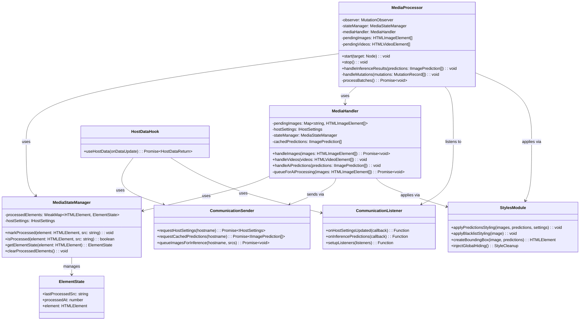

# Content Script Module

This folder contains the HaramBlock content script that runs on web pages to detect, analyze, and
filter media content. The content script is the main interface between the extension and the web
page's DOM.

## Architecture Overview

The content script follows a modular architecture with clear separation of concerns:

- **Entry Point** (`index.ts`) - Main content script initialization and lifecycle management
- **DOM Processing** (`dom/`) - Media element detection, processing, and state management
- **Communication** (`communication/`) - Two-way messaging with the background script
- **Hooks** (`hooks/`) - Reactive data management for host settings and predictions
- **Presentation** (`presentation/`) - Visual styling, effects, and CSS injection

## Module Descriptions

### Entry Point

#### `index.ts`

The main content script entry point that orchestrates the entire media filtering system. It:

- Initializes global hiding styles to prevent content flash
- Uses the `useHostData` hook to get host settings and cached predictions
- Creates and manages `MediaProcessor` instances based on host policy
- Sets up inference result listeners for real-time AI predictions
- Handles cleanup on page unload

### DOM Processing (`dom/`)

#### `MediaStateManager.ts`

Manages the processing state of media elements to prevent duplicate processing and maintain
performance.

**Key Features:**

- Uses `WeakMap` for memory-efficient element tracking
- Tracks last processed source URL and timestamp for each element
- Stores host settings for consistent processing decisions
- Provides methods to mark, check, and retrieve element processing state

**Interface:**

```typescript
export interface ElementState {
  lastProcessedSrc: string;
  processedAt: number;
  element: HTMLElement;
}
```

#### `MediaProcessor.ts`

The core orchestrator for media element processing, combining DOM observation with AI-powered
content analysis.

**Key Features:**

- Uses `MutationObserver` to detect new/changed media elements
- Implements batched processing for performance optimization
- Manages processing queues for images and videos separately
- Applies immediate styling while queuing for AI analysis
- Handles AI prediction results and applies advanced styling

**Configuration:**

- Throttle delay: 500ms for batch processing
- Batch size: 20 elements per batch
- Monitors src, srcset attributes and DOM changes

#### `MediaHandler.ts`

Unified handler for both image and video processing with AI integration.

**Key Features:**

- Categorizes images into cached vs. uncached for efficient processing
- Queues uncached images for AI inference via background script
- Handles AI prediction results and applies appropriate styling
- Manages pending image state during AI processing
- Provides video processing foundation (currently applies blacklist styling)

### Communication (`communication/`)

#### `listener.ts`

Handles all inbound messages from the background script using webext-bridge.

**Message Types:**

- `HOST_SETTINGS_UPDATED` - Notifies when host settings change
- `INFERENCE_PREDICTIONS` - Delivers AI prediction results

**Key Features:**

- Provides filtered listeners for specific hostnames
- Offers utility functions for setting up multiple listeners
- Returns cleanup functions for proper resource management

#### `sender.ts`

Manages all outbound communication to the background script.

**Key Functions:**

- `requestHostSettings()` - Gets current host settings
- `requestCachedPredictions()` - Retrieves cached AI predictions
- `queueImagesForInference()` - Sends images for AI processing
- `requestHostData()` - Parallel fetch of settings and predictions

### Hooks (`hooks/`)

#### `useHostData.ts`

Unified reactive hook for managing host settings and cached predictions.

**Key Features:**

- Fetches both settings and predictions in parallel for efficiency
- Automatically refreshes data when host settings change
- Provides loading state and manual refresh capabilities
- Handles hostname normalization using `getEffectiveHostname()`
- Triggers page reload on settings changes to ensure clean state

**Return Interface:**

```typescript
{
  settings: IHostSettings | undefined;
  predictions: IImagePrediction[];
  isLoading: () => boolean;
  refresh: () => Promise<void>;
  cleanup: () => void;
}
```

### Presentation (`presentation/`)

#### `styler.ts`

Comprehensive styling module that handles all visual effects and CSS injection.

**Core Functions:**

1. **Global Style Management:**
   - `injectGlobalHiding()` - Prevents content flash during initialization
   - `injectPredictionStyles()` - Injects CSS for prediction overlays and effects

2. **Prediction-Based Styling:**
   - `applyPredictionsStyling()` - Main entry point for AI-driven styling
   - `applyImagePredictionStyling()` - Applies intelligent styling based on confidence scores
   - `applyPredictionBlur()` - Applies blur effects for high-confidence predictions

3. **Policy-Based Styling:**
   - `applyBlacklistStyling()` - Applies heavy blur and opacity reduction
   - `applyDefaultStyling()` - Applies basic filtering while waiting for AI analysis

4. **Overlay Creation:**
   - `createBoundingBox()` - Creates bounding box overlays for detected objects
   - `createPolygon()` - Creates segmentation polygon overlays

**Styling Strategy:** The module implements a two-stage filtering approach:

1. **Immediate Protection:** Basic styling applied instantly when images are detected
2. **AI-Enhanced Filtering:** Sophisticated styling applied after AI analysis completes

**Visual Indicators:**

- 🎯 Badge for cached predictions
- 🤖 Badge for fresh AI predictions
- Color-coded bounding boxes by object class
- Hover effects to temporarily reveal content

## Class Relationships



## Processing Flow

1. **Initialization:**
   - Content script injects global hiding styles
   - `useHostData` hook fetches host settings and cached predictions
   - `MediaProcessor` is created with settings and cached data

2. **Media Detection:**
   - `MutationObserver` detects new/changed media elements
   - Elements are queued for batch processing
   - Immediate basic styling is applied to prevent content flash

3. **AI Processing:**
   - Images are categorized as cached vs. uncached
   - Uncached images are sent to background script for AI analysis
   - Cached predictions are applied immediately

4. **Result Application:**
   - AI predictions are received via message listener
   - Advanced styling is applied based on confidence scores
   - Visual overlays (bounding boxes/polygons) are created if enabled

5. **State Management:**
   - Processing state is tracked to prevent duplicate work
   - Element states are managed efficiently using WeakMap
   - Cleanup occurs on page unload or settings changes

## Performance Considerations

- **Batched Processing:** Media elements are processed in batches to reduce DOM manipulation
  overhead
- **Throttled Observation:** Mutation observer uses 500ms throttle to prevent excessive processing
- **WeakMap State:** Element state uses WeakMap for automatic garbage collection
- **Cached Predictions:** Previously analyzed images skip AI processing
- **Parallel Requests:** Settings and predictions are fetched simultaneously

## Error Handling

- Communication failures are logged and gracefully handled
- Image loading errors don't prevent processing of other images
- AI processing failures don't affect cached predictions
- Cleanup functions prevent memory leaks on page navigation
