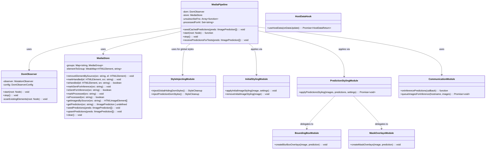

# Content Script Module

This folder contains the HaramBlock content script that runs on web pages to detect, analyze, and
filter media content. The content script is the main interface between the extension and the web
page's DOM.

## Architecture Overview

The content script follows a modular architecture with clear separation of concerns:

- **Entry Point** (`index.ts`) - Main content script initialization and lifecycle management
- **Core** (`core/`) - DOM observation, state registry, AI queueing, background bridge, prediction
  store, and orchestration
- **Communication** (`communication/`) - Two-way messaging with the background script
- **Hooks** (`hooks/`) - Reactive data management for host settings and predictions
- **Presentation** (`presentation/`) - Visual styling, effects, and CSS injection

## Module Descriptions

### Entry Point

#### `index.ts`

The main content script entry point that orchestrates the entire media filtering system. It:

- Initializes global hiding styles to prevent content flash
- Uses the `useHostData` hook to get host settings and cached predictions
- Creates and manages content flow using `MediaPipeline` based on host policy
- Sets up inference result listeners for real-time AI predictions
- Handles cleanup on page unload

### DOM Processing (`core/`)

#### `core/MediaStore.ts`

Unified state management for media elements and AI predictions, keyed by media source URL.
Consolidates multiple DOM elements that point to the same `src` and prevents duplicate processing.

**Key Features:**

- Groups elements by source URL with processing state tracking
- Manages cached AI predictions per source
- Tracks styling and AI processing state per element group
- Provides element lifecycle management (add/remove by source)
- Supports seeding with cached predictions and upserting new ones
- Maintains proper state flow: handled → sentForInference → processed
- `upsertPredictions()` correctly marks predictions as processed without affecting sentForInference
  state
- **State tracking methods**: `markHandled()`, `markSentForInference()`, `markProcessed()` with
  corresponding `isHandled()`, `isSentForInference()`, `isProcessed()` checks
- **Dynamic src handling**: Automatically moves DOM elements between groups when their `src`
  attribute changes (e.g., Vue reactive updates)
- **Element-to-group tracking**: Uses WeakMap to track which group each DOM element belongs to for
  efficient cleanup
- **Prevents flickering**: Ensures predictions only apply to DOM elements that still match the
  prediction source

#### `core/DomObserver.ts`

Clean MutationObserver wrapper that directly processes DOM changes and emits structured callbacks
for media element lifecycle events.

**Key Features:**

- Scans existing DOM elements on startup to catch pre-existing media
- Processes added/removed nodes with nested element detection
- **Monitors attribute changes** for media elements with `attributeOldValue: true` for debugging
- Observes different media source attributes: `src`, `srcset`, `data-src`, `data-srcset`,
  `data-lazy-src`
- **Reactive framework support**: Detects when Vue/React/Angular dynamically change `src` attributes
- **Real-time debugging**: Logs attribute changes with old/new values for troubleshooting

#### `core/MediaPipeline.ts`

The main orchestrator that combines DOM observation with AI-powered content analysis and styling.

**Key Features:**

- Uses `DomObserver` for DOM change detection
- Manages media elements through `MediaStore` for state consolidation
- Applies immediate protective styling based on policy (blacklist/whitelist)
- Handles cached predictions instantly, queues uncached images for AI processing
- Tracks AI processing per source URL to prevent duplicate inference requests
- Applies intelligent styling when AI predictions arrive
- Manages cleanup and resource disposal
- **Attribute change handling**: Responds to `onAttributesChanged` events by re-processing images
  with new sources
- **Anti-flickering logic**: Uses `requestAnimationFrame` to ensure proper timing between overlay
  creation and initial style removal
- **Comprehensive debugging**: Extensive logging with `flickering` tag to track styling operations
  and timing

### Communication (`communication/`)

#### `listener.ts`

Handles all inbound messages from the background script using webext-bridge.

**Message Types:**

- `HOST_SETTINGS_UPDATED` - Notifies when host settings change
- `INFERENCE_PREDICTIONS` - Delivers AI prediction results

**Key Features:**

- Provides filtered listeners for specific hostnames
- Offers utility functions for setting up multiple listeners
- Returns cleanup functions for proper resource management

#### `sender.ts`

Manages all outbound communication to the background script.

**Key Functions:**

- `requestHostSettings()` - Gets current host settings
- `requestCachedPredictions()` - Retrieves cached AI predictions
- `queueImagesForInference()` - Sends images for AI processing
- `requestHostData()` - Parallel fetch of settings and predictions

### Hooks (`hooks/`)

#### `useHostData.ts`

Unified reactive hook for managing host settings and cached predictions.

**Key Features:**

- Fetches both settings and predictions in parallel for efficiency
- Automatically refreshes data when host settings change
- Provides loading state and manual refresh capabilities
- Handles hostname normalization using `getEffectiveHostname()`
- Triggers page reload on settings changes to ensure clean state

**Return Interface:**

```typescript
{
  settings: IHostSettings | undefined;
  predictions: IImagePrediction[];
  isLoading: () => boolean;
  refresh: () => Promise<void>;
  cleanup: () => void;
}
```

### Presentation (`presentation/`)

#### `styleInjecting.ts`

Core CSS injection module that handles global style management.

**Core Functions:**

- `injectGlobalHidingDomStyles()` - Prevents showing browser-cached images before DOM load, returns
  cleanup function
- `injectPredictionDomStyles()` - Injects CSS classes for blur effects and overlays

#### `initialStyling.ts`

Handles initial protective styling applied to media elements before AI analysis.

**Core Functions:**

- `applyInitialImageStyling()` - Applies protective blur while waiting for AI analysis
- `removeInitialImageStyling()` - Removes protective styling after AI analysis

#### `predictionStyling.ts`

Handles AI prediction-based styling application.

**Core Functions:**

- `applyPredictionsStyling()` - **Async function**: Applies AI-based styling using blur boxes or
  mask overlays based on host settings, returns Promise that resolves when overlays are positioned

#### `boundingBox.ts`

Creates precise bounding box blur overlays for detected objects.

**Key Features:**

- `createBlurBoxOverlays()` - Creates positioned blur overlays using backdrop-filter
- Responsive positioning that adapts to image scaling and viewport changes
- Uses ResizeObserver and scroll/resize listeners for dynamic updates
- Clips blur boxes to visible image areas for performance
- Automatically manages parent element positioning (sets relative if static)

#### `maskOverlays.ts`

Advanced segmentation-based visual overlays using canvas and mask data.

**Key Features:**

- `createMaskOverlays()` - Creates pixelated overlay effects using segmentation masks
- Unified canvas approach combining multiple masks into single overlay
- Pixelated mosaic effect (20px blocks) applied only to masked regions
- Adaptive sampling and bounds checking for performance
- Alpha masking technique preserving original image colors with pixelation

**Styling Strategy:** The module implements a two-stage filtering approach:

1. **Immediate Protection:** Basic blur styling applied instantly when images are detected
2. **AI-Enhanced Filtering:** Sophisticated overlays applied after AI analysis using either bounding
   boxes or segmentation masks

## Class Relationships



## Processing Flow

1. **Initialization:**
   - Content script injects global hiding styles to prevent display of cached images \*Removed after
     DOMContentLoaded event
   - `useHostData` fetches host settings and cached predictions in parallel
   - `MediaPipeline` is created with settings and seeded with cached predictions
   - `applyInitialImageStyling` is applied to existing images (protective blurring/masking)
   - `DomObserver` starts monitoring the DOM and scans existing elements

2. **Media Detection:**
   - `DomObserver` detects added, removed, and attribute-changed media elements
   - Direct callback interface eliminates event bus complexity
   - Processes both direct elements and nested elements within added nodes
   - **Attribute monitoring**: Detects when reactive frameworks change `src` attributes dynamically

3. **Immediate Processing:**
   - Whitelist policy: Skip processing entirely
   - Default policy: Check for cached predictions first, then apply initial protective styling using
     `applyInitialImageStyling()`
   - Elements are marked as handled using `markHandled()` to prevent duplicate processing

4. **Dynamic Source Handling:**
   - When `onAttributesChanged` detects `src` changes (e.g., Vue reactive updates):
     - Element is automatically moved between MediaStore groups via `markHandled()`
     - New `src` is queued for AI inference if not cached via `queueForInference()`
     - Prevents orphaned predictions from affecting wrong elements

5. **AI Processing Queue:**
   - Images without cached predictions are queued for AI inference via `queueForInference()`
   - Uses `isSentForInference()` check to prevent duplicate requests per source
   - Only queues images that meet minimum size requirements and are fully loaded
   - Attaches one-time load listeners for images not yet ready
   - Sources are marked as sent for inference using `markSentForInference()`

6. **State Management:**
   - `MediaStore` groups elements by source URL and tracks processing state
   - **Element-to-group tracking**: WeakMap ensures each element belongs to only one group
   - Prevents duplicate styling and AI processing per source using state flags
   - Maintains element lifecycle via `markHandled()` and `removeElementBySource()`
   - **Automatic cleanup**: Removes empty groups when elements are moved

7. **Result Application (Anti-Flickering):**
   - AI predictions arrive via communication listener in `onPredictions()`
   - `MediaStore` is updated with new predictions via `upsertPredictions()`
   - **Async styling application**: `applyPredictionsStyling()` uses `requestAnimationFrame` for
     proper timing
   - **Only applies to matching elements**: `getImagesBySource()` returns elements that still match
     the prediction source
   - Initial protective styling is removed via `removeInitialImageStyling()` ONLY after overlays are
     positioned
   - Sources are marked as processed using `markProcessed()` to prevent re-styling

8. **Cleanup:**
   - On page unload, `DomObserver` disconnects via `stop()` and `MediaStore` clears via `clear()`
   - Prediction listeners are unsubscribed via stored cleanup functions
   - WeakMap references are automatically garbage collected

## Performance Considerations

- **Direct Callback Processing:** Eliminated event bus overhead with direct callback interface
- **Source-Based Grouping:** `MediaStore` groups elements by source URL to process duplicate media
  efficiently
- **Processing State Tracking:** Uses state flags (`handled`, `sentForInference`, `processed`) to
  prevent duplicate work per source
- **State-Based Deduplication:** Uses `isSentForInference()` checks to prevent duplicate inference
  requests
- **One-Time Load Listeners:** Avoids repeated listener attachments with proper cleanup
- **Cached Predictions:** Previously analyzed images skip AI processing and are styled immediately
- **Parallel Data Fetching:** Settings and predictions are fetched simultaneously during
  initialization
- **Minimal DOM Queries:** Element grouping reduces the need for repeated DOM traversals
- **WeakMap Efficiency:** Element-to-group tracking uses WeakMap for automatic garbage collection
- **RequestAnimationFrame Batching:** Overlay creation is batched using `requestAnimationFrame` for
  smooth rendering
- **Parallel Prediction Processing:** Multiple predictions are processed concurrently using
  `Promise.all()`
- **Empty Group Cleanup:** Automatically removes unused groups to prevent memory leaks

## Error Handling

- Communication failures are logged and gracefully handled
- Image loading errors don't prevent processing of other images
- AI processing failures don't affect cached predictions
- Metadata extraction via HEAD is best-effort and ignored on failure
- Cleanup functions prevent memory leaks on page navigation
- **URL mismatch detection**: Logs errors when predictions don't match current DOM element sources
- **Graceful orphaned predictions**: Predictions for elements that no longer exist are safely
  ignored
- **Attribute change failures**: Robust handling of malformed or invalid `src` attribute changes

## Notes on Policies and Thresholds

- **Whitelist policy:** Completely skips all processing, allowing all content through
- **Blacklist policy:** Applies immediate heavy blur/opacity for both images and videos
- **Default policy:** Applies protective styling while waiting for AI analysis
- Minimum image size for AI processing is configurable via host settings
- Images not meeting size requirements get one-time load listeners for re-evaluation after loading
- Observed attributes include common lazy-load patterns: `src`, `srcset`, `data-src`, `data-srcset`,
  `data-lazy-src`
- Processing state is tracked per source URL to prevent duplicate work across multiple DOM elements
- **Reactive framework compatibility**: Handles Vue, React, Angular dynamic `src` changes seamlessly
- **Anti-flickering timing**: `requestAnimationFrame` ensures overlays render before protective
  styles are removed
- **Debug logging**: Comprehensive logging with `flickering` tag and `extractUrlId` for readable
  debugging
